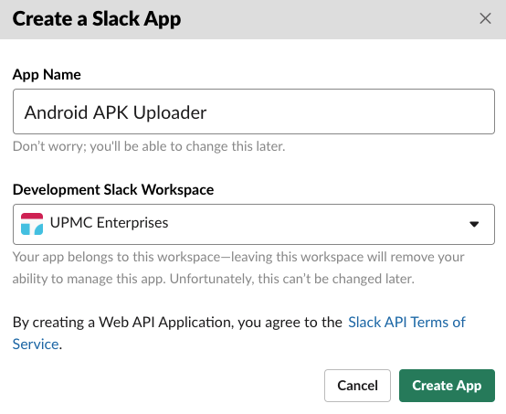
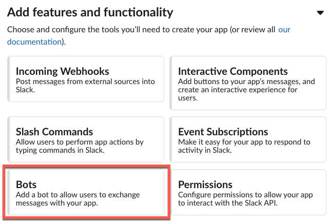
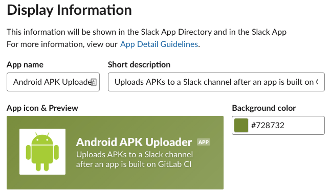
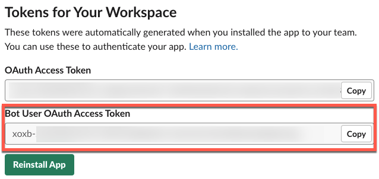

<div align="center">


<br>
<br>

<h1>Gradle Slack Uploader Plugin<br/><sub>Upload anything to a Slack channel from Gradle</sub></h1>

[📱 Demo](https://fabric.io/myupmc/android/apps/com.upmc.enterprises.myupmc.dev/beta/releases/latest) |
[📖 Documentation](https://upmcenterprises.atlassian.net/wiki/spaces/MyUPMCMobile) |
[📆 Version History](https://github.com/upmc-enterprises/gradle-slack-uploader-plugin/releases)

```text
"Works to help you improve your CI and CD practices."
```

<!-- [](https://kotlinlang.org/)
[](https://gradle.org/)
[](https://jitpack.io/#upmc-enterprises/gradle-slack-uploader) -->

<hr />
</div>

Sometimes it is not always practical to push new software from Git straight into production. This plugin helps minimize some of the effort required to get your software into customer's hands by pushing it to an intended, internal group over Slack.

Here are some other useful examples of how this plugin can help:

- Send Android or iOS apps to the development team's channel for uploading into the appropriate distribution store
- Upload files to a QA channel for verification and testing
- Surface artifacts from a build to better understand its performance

Whenever a file is uploaded, you can expect it to feel very familiar and flexible:

<div align="center">


</div>

# Getting Started

There are two parts to installing this plugin. The first is, of course, installing it into your Gradle script and the second part is creating a Slack bot account with which the plugin uses to upload a file.

## Create the Slack Bot

Unless your Slack administrator has banned unapproved apps from being installed into your workspace, then just about anyone should be able to follow these steps.

1. Go to [api.slack.com/apps](https://api.slack.com/apps/)
1. Press the *Create New App* button. Apps within Slack enable automated bots to post messages to a Slack channel.
1. In the pop-up dialog, give the app a friendly name. This name is for your reference only and is not reflected as the bot's name in a Slack workspace whenever it posts a message. You will configure the bot's name later.

    

1. After creating the app, click on the *Bots* button, under the *Add Features and Functionality* section

    

1. Click the *Add a Bot User* button and fill out the form. The Display Name is effectively the bot's First and Last Name, which appears as the sender of a Slack message. You can populate this form as you please. Here is an example set up:

    

1. Save your changes and the go back to the *Basic Information* page, which is available from the left-column navigation
1. Under the *Add Features and Functionality* section, both the *Bots* and *Permissions* features should show as completed

    

1. **(Optional)** Populate the *Display Information*. This can be thought of as the bot's profile picture and status message.

    

1. Click on *Install Your App to Your Workspace* and follow Slack's installation and permission prompts
1. After installing the app, go back to the app's configuration
1. On the left-column navigation go to *OAuth & Permissions*
1. Make a note of the *Bot User OAuth Access Token* (not the OAuth Access Token). You will need this for a subsequent step.

    
