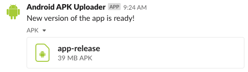
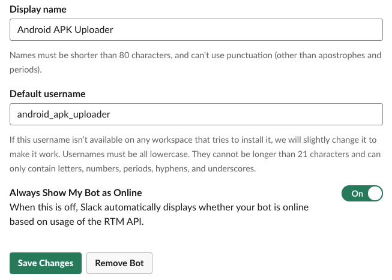

<div align="center">


<br>
<br>

<h1>Gradle Slack Uploader Plugin<br/><sub>Upload anything to a Slack channel from Gradle</sub></h1>

[🖥 Demo](#build-and-run-this-project) |
[📖 Documentation](#getting-started) |
[📆 Version History](https://github.com/upmc-enterprises/gradle-slack-uploader-plugin/releases)

```text
"Works to help you improve your CI and CD practices."
```

[](https://kotlinlang.org/)
[](https://gradle.org/)
[](https://github.com/upmc-enterprises/gradle-slack-uploader-plugin/releases)

[](https://jitpack.io/#upmc-enterprises/gradle-slack-uploader)

<hr />
</div>

Sometimes it is not always practical to push new software from Git straight into production. This plugin helps minimize some of the effort required to get your software into customer's hands by pushing it to an intended, internal group over Slack.

Here are some other useful examples of how this plugin can help:

- Send Android or iOS apps to the development team's channel for uploading into the appropriate distribution store
- Upload files to a QA channel for verification and testing
- Surface artifacts from a build to better understand its performance

Whenever a file is uploaded, you can expect it to feel very familiar and flexible:

<div align="center">



</div>

# Getting Started

There are two parts to installing this plugin. The first part is for creating a Slack bot account with which the plugin uses to upload a file and the second part is, of course, installing it into your Gradle script.

## Create the Slack Bot

Unless your Slack administrator has banned unapproved apps from being installed into your workspace, then just about anyone should be able to follow these steps.

1. Go to [api.slack.com/apps](https://api.slack.com/apps/)
1. Press the *Create New App* button. Apps within Slack enable automated bots to post messages to a Slack channel.
1. In the pop-up dialog, give the app a friendly name. This name is for your reference only and is not reflected as the bot's name in a Slack workspace whenever it posts a message. You will configure the bot's name later.

    

1. After creating the app, click on the *Bots* button, under the *Add Features and Functionality* section

    

1. Click the *Add a Bot User* button and fill out the form. The Display Name is effectively the bot's First and Last Name, which appears as the sender of a Slack message. You can populate this form as you please. Here is an example set up:

    

1. Save your changes and the go back to the *Basic Information* page, which is available from the left-column navigation
1. Under the *Add Features and Functionality* section, both the *Bots* and *Permissions* features should show as completed

    

1. **(Optional)** Populate the *Display Information*. This can be thought of as the bot's profile picture and status message.

    

1. Click on *Install Your App to Your Workspace* and follow Slack's installation and permission prompts
1. After installing the app, go back to the app's configuration
1. On the left-column navigation go to *OAuth & Permissions*
1. Make a note of the *Bot User OAuth Access Token* (not the OAuth Access Token). You will need this for a subsequent step. **Keep this token safe, as having access to it enables anyone to send messages to your workspace.**

    

## Install the Plugin into Gradle

After adding a bot account to Slack, we now have enough information to add the plugin to Gradle.

### Using the Plugins DSL (Recommended)

Newer version of Gradle support the updated [plugin DSL](https://docs.gradle.org/current/userguide/plugins.html#sec:plugins_block). These steps show how to install the plugin with this technique.

1. Note the latest release of this plugin for use in the next step: [](https://github.com/upmc-enterprises/gradle-slack-uploader-plugin/releases)
1. Open your `build.gradle` file, and add this code to load and applythe plugin:

    ```groovy
    plugins {
        id "com.oliverspryn.gradle.slackuploader" version "<latest version>"
    }
    ```

### Using the Legacy Plugin Application

Older versions of Gradle do not support the modern [plugin DSL](https://docs.gradle.org/current/userguide/plugins.html#sec:plugins_block). Use this technique if the above approach fails.

1. Note the latest release of this plugin for use in the next step: [](https://github.com/upmc-enterprises/gradle-slack-uploader-plugin/releases)
1. Open your `build.gradle` file, and add this code to load and applythe plugin:

    ```groovy
    buildscript {
        repositories {
            maven { url "https://plugins.gradle.org/m2/" }
        }

        dependencies {
            classpath "gradle.plugin.com.oliverspryn.gradle:slack-uploader:<latest-version>"
        }
    }
    ```

1. Now, apply it:

    ```groovy
    apply plugin: "com.oliverspryn.gradle.slackuploader"
    ```

### Using JitPack (Not Recommended)

For the sake of convinence, this plugin is also available on JitPack. These steps show how to install the plugin from there.

1. Note the latest release of this plugin for use in the next step: [](https://github.com/upmc-enterprises/gradle-slack-uploader-plugin/releases)
1. Open your `build.gradle` file, and add this code to load the plugin:

    ```groovy
    buildscript {
        repositories {
            maven { url "https://jitpack.io" }
        }

        dependencies {
            classpath "com.github.upmc-enterprises:gradle-slack-uploader:<latest version>"
        }
    }
    ```

1. Now, apply it:

    ```groovy
    apply plugin: "com.oliverspryn.gradle.slackuploader"
    ```

# Configuring the Plugin

There are a few ways you can use this plugin, depending on your needs. You may wish to adapt how you use this based on your setup. Before diving into the code, let's cover what this plugin offers:

- **Configuration Block:** You must *always* configure this plugin with a block since it has required paramters:

    ```groovy
    uploadFileToSlack {
        ...
    }
    ```

    Otherwise, your build will fail with an exception until the necessary information is provided.
- **Task:** To manually kick off an upload task, run the `uploadFileToSlack` task, like so:

    ```bash
    ./gradlew uploadFileToSlack
    ```

    Keep in mind you'll probably want a few commands beforehand to run a build and generate artifacts.

## Configuration Block Options

There are several parameters which are provided to alter the behavior of the plugin. Here is an example of a fully configured block:

```groovy
uploadFileToSlack {
    comment "Our app is ready for release!"
    channels "public-release-channel", "developers"
    enabled true
    filePath "build/outputs/apk/release/app-release.apk"
    token GRADLE_SLACK_UPLOADER_PLUGIN_TOKEN ?: "" // Defined in the global gradle.properties file
}
```

Here is an elaboration of each of these options:

| **Option** | **Default** | **Required** |                              **Description**                              |
|:----------:|:-----------:|:------------:|:-------------------------------------------------------------------------:|
|  `comment` |    *None*   |       ✅      | The comment which is shown above the file attachment in Slack             |
| `channels` |    *None*   |       ✅      | Comma separated list of channels which will receive the file              |
|  `enabled` |    `true`   |       🚫      | Whether or not to run the plugin. Useful to restrict for use only on CIs. |
| `filePath` |    *None*   |       ✅      | Path of the artifact to upload relative to the project root               |
|   `token`  |    *None*   |       ✅      | Slack bot's OAuth access token                                            |

## Technique 1 - Manually Call the Task

This approach is slightly more manual, but could provide more clarity into your build process.

1. Add the configuration block, as described in the [previous section](#configuration-block-options)
1. When running the build, call the task manually:

    ```bash
    ./gradlew build # For example
    ./gradlew uploadFileToSlack # Call this last
    ```

## Technique 2 - Attach the Plugin to the Task Graph

Modifying Gradle's task graph is very simple and allows a task to attach itself to a more important step. For example, it's very common to run `build` to compile an application. Let's guarantee that the `build` task is run each time `uploadFileToSlack` is called.

1. Add the configuration block, as described in the [previous section](#configuration-block-options)
1. Add this block to run `build` before `uploadFileToSlack` is executed:

    ```groovy
    afterEvaluate {
        uploadFileToSlack.dependsOn build
    }
    ```

1. Next, run just the `uploadFileToSlack` task and the `build` task will run just beforehand to ensure that there are artifacts to upload:

    ```bash
    ./gradlew uploadFileToSlack
    ```

# Build and Run this Project

If you would like to pull the source for the plugin and try it out yourself, here are a few things to know before getting started:

- You'll need a variable in your global `gradle.properties` file called `GRADLE_SLACK_UPLOADER_PLUGIN_TOKEN`. This is a Slack bot OAuth token you'll need to create to test the plugin locally.
- `./scripts/demo.sh` contains a small bootstrapping script to build the plugin and run the demo project in one command

The demo script publishes the plugin's JAR file to a local Maven repository located at `<project root>/repo` and then that JAR is picked up the demo implementation looking at the same repository. The end result of a successful run is a small text file appearing in the intended Slack channel from a bot account.

# FAQs

Here are answers to a few questions you may encounter when setting up or using the plugin:

- **Does this plugin support uploading more than one file at a time?** No. Please consider zipping up multiple files and sending them out as one package if you need to upload more than one file to Slack.
- **How can I conditionally enable the plugin only on CI builds?** Most CIs have a set of default environment variables which identify themselves as a build environment. For example, [Travis CI](https://docs.travis-ci.com/user/environment-variables/#default-environment-variables), [Azure Pipelines](https://docs.microsoft.com/en-us/azure/devops/pipelines/build/variables?view=azure-devops&tabs=yaml#agent-variables), and [GitLab CI](https://docs.gitlab.com/ee/ci/variables/#predefined-environment-variables) all have documentation on this. For instance, on a Travis CI build, one could conditionally enable the plugin like so:

    ```groovy
    static def isCIMachine() {
       return System.getenv("CI") != null
    }

    uploadFileToSlack {
        enabled = isCIMachine()
        ...
    }
    ```

<br>
<hr />
<br>
<br>

<div align="center">
<p>This plugin was inspired by a need for the <a href="https://myupmc.upmc.com" target="_blank">MyUPMC</a> project at <a href="https://enterprises.upmc.com" target="_blank">UPMC Enterprises</a></p>

<a href="https://myupmc.upmc.com" target="_blank">
    
</a>

<a href="https://enterprises.upmc.com" target="_blank">
    
</a>
</div>
